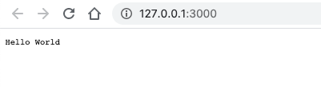

# STARTING WITH NODE 26_04_21
Creating a server:
https://nodejs.org/dist/latest-v14.x/docs/api/http.html#http_http_createserver_options_requestlistener
Listening in a particular port...

## WEB SERVER PORT
NodeJS 443
HTTP 80
Email 25
FTP 21
## Anatomy of http request
1.- HTTP Method/verb => (POST,GET,PUT) What are you going to do with the resource,keep it,delete it,updated it :

```
(CRUD)
    -Ceate(POST)
    -Read(GET)
    -Update(PUT/PATCH)
    -Delete(DELETE)
```

2.- URL (API endpoint) => (/post/1) Get the resourse back
3.-Headers(Metadata) => {"Content-Type":"application/json"}
4.-Body(POST,PUT,PATCH) => {title:"New post"}




