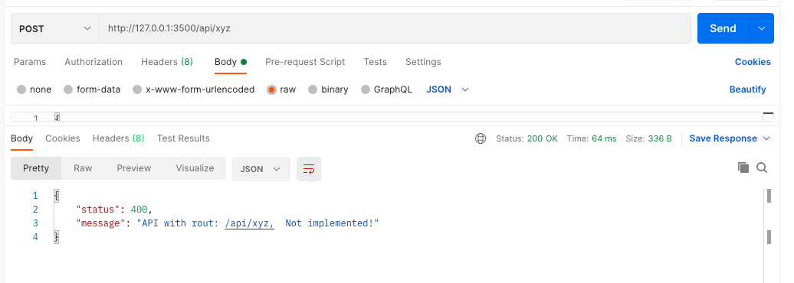
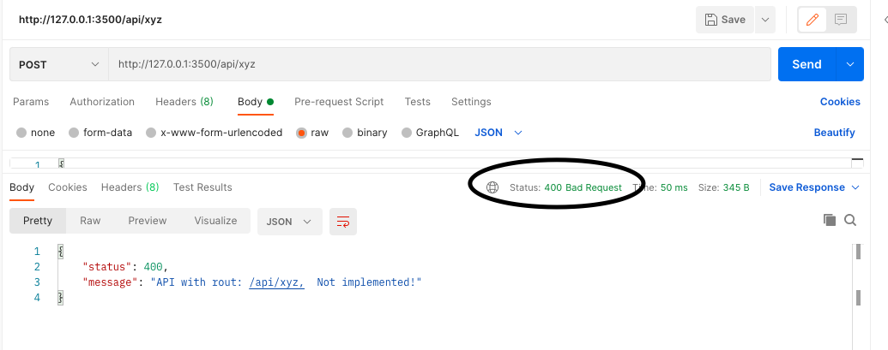
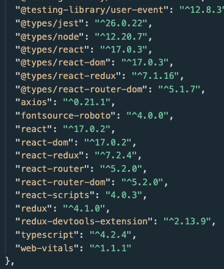
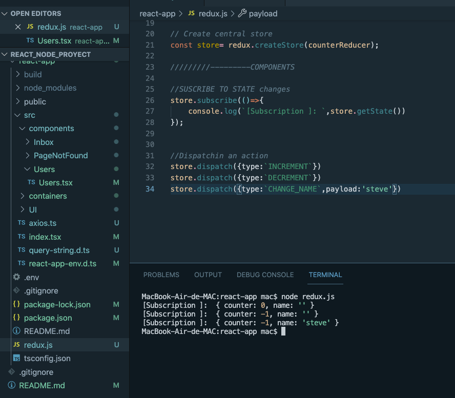

# Creacion de tipos de errores, funciones sustirtuidas y fundamentos de redux





# Starting with redux
https://redux.js.org/

## Installing 
https://www.npmjs.com/package/react-redux
```npm i react-redux```

https://www.npmjs.com/package/redux
```npm i redux```

https://www.npmjs.com/package/@types/react-redux
```npm i @types/react-redux```

https://www.npmjs.com/package/redux-devtools-extension
```npm i redux-devtools-extension```

