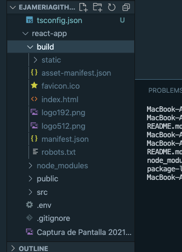
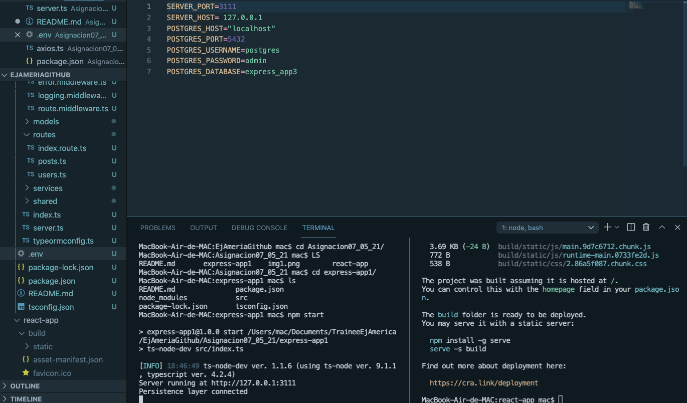
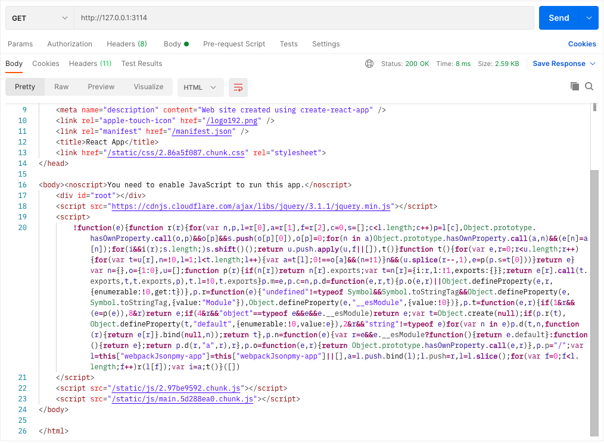
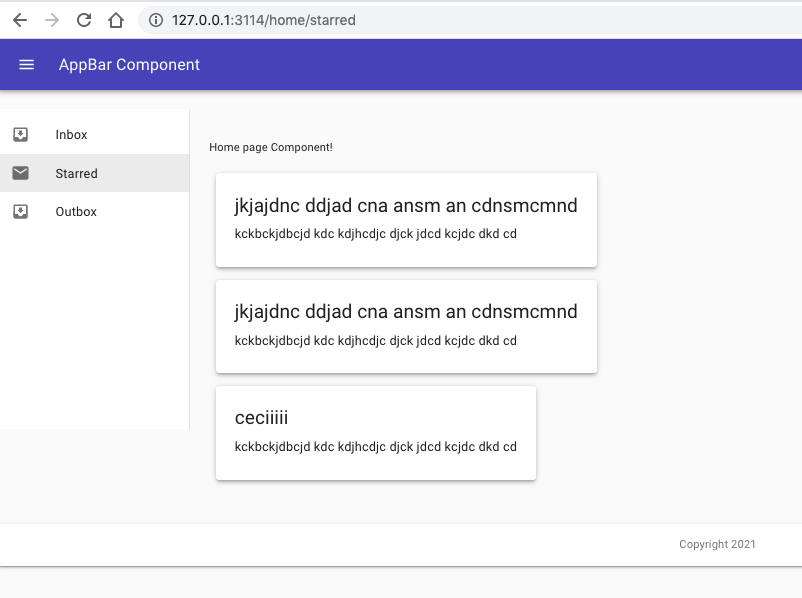
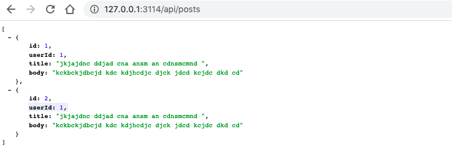
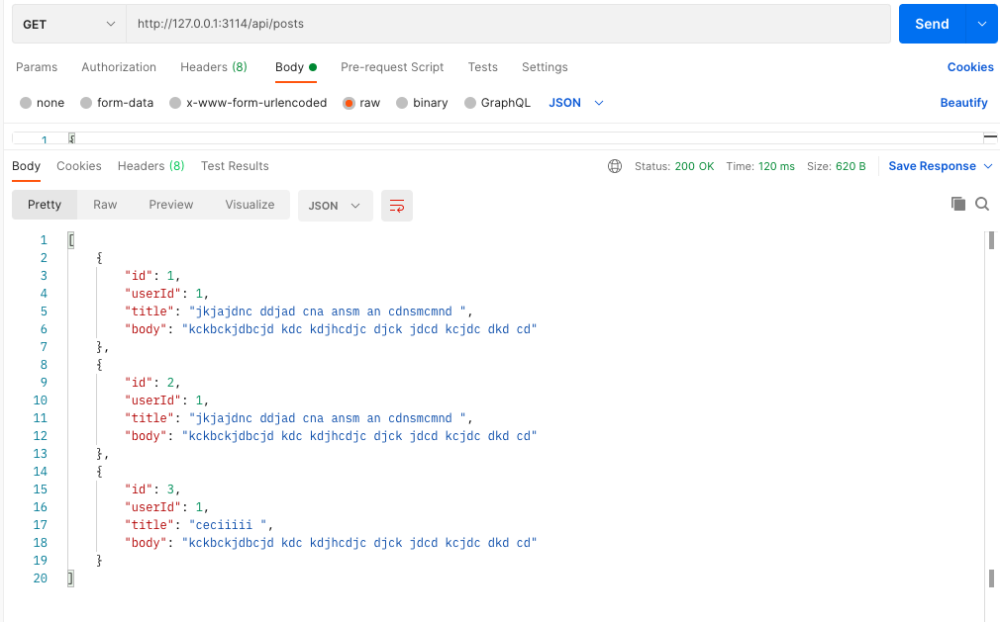

# Connecting express-app and react-app for deployment(production)
link the node proyect with react: We have to configure the node server to an static file 

We are going to build the react aplication for deployment:
```MacBook-Air-de-MAC:react-app mac$ npm run build```

We are going to find a directory called build:



The statics files of the commonmiddleware have to come frome the previous directory(build):
look at route.middleware.ts 

When we try to run it , we want to both aplications have the same domain, so we are going to work with the axios file

```//No me gustaria comocar mi link en cada uno 
import axios, { AxiosInstance, AxiosRequestConfig, AxiosResponse } from 'axios';

const instance:AxiosInstance = axios.create({
    // baseURL:'https://jsonplaceholder.typicode.com'
    // baseURL:'http://127.0.0.1:3111'  We dont need it, integrated in the package.json

```

and adding to the package.json 

```   "development": [
      "last 1 chrome version",
      "last 1 firefox version",
      "last 1 safari version"
    ]
  },
  "proxy":"http://127.0.0.1:3111"
}
// proxy should be the same as express app
```

build it again (react-app): 
```MacBook-Air-de-MAC:react-app mac$ npm run build```

Openning th node app, and running it:


Comprobando en postman y en aplicacion :






