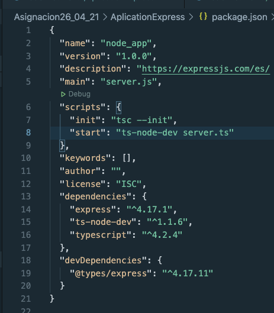
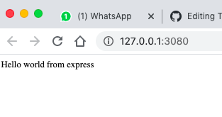

# USING FRAMEWORK FROM NODE JS -> EXPRESSJS
https://expressjs.com/es/ 
https://expressjs.com/es/starter/installing.html 
Firsts steps:

-Starting node:
```npm init```

-Installing express framework :
```npm install express --save```

-Installing typescript :
```npm i typescript```

-Adding init to package.json an running it :
```npm run init```

-Adding a module that compiles your ts file and restart when your files are modified
https://www.npmjs.com/package/ts-node-dev 
```npm i ts-node-dev```

-Adding typescript definition for express
https://www.npmjs.com/package/@types/express
```npm i @types/express```

## FINAL PACKAGE JSON


To run :
```npm start```



# HELLO WORLD WITH EXPRESS
http://expressjs.com/es/starter/hello-world.html#ejemplo-hello-world
