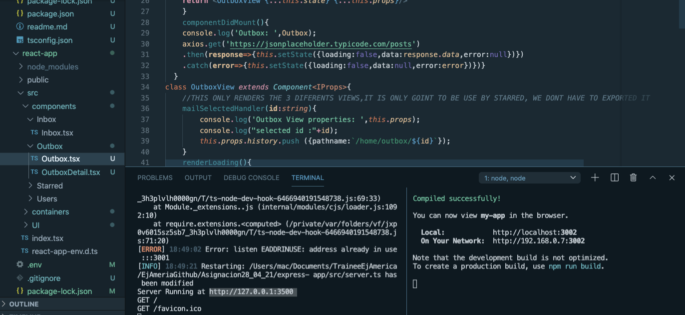

# IMPLEMENTANDO EXPRESS EN NUESTRO PROYECTO DE REACT 

Este fue el link que estuvimos usando para tomar los recursos:


Ahora lo vamos a implementar nosotros desde el backend:

1.- Primero corriendo ambos programas usaremos el dominio de nuestro proyecto express en nuestro proyecto de react:



Pero no quiero ponerlo en cada link , asi que me voy a ayudar de axios para comunicar:
https://www.npmjs.com/package/axios 
Creando una instancia que me permita usarla en cada referencia alservido y cambiarla por mi servidor
```
import axios, { AxiosInstance } from 'axios';

const instance:AxiosInstance = axios.create({
    baseURL:'https://jsonplaceholder.typicode.com'
});

export default instance;
```

Despues de agregar unos interceptores,que actuan muy similar a los middleware del back


This is a security error by browser:
Access to XMLHttpRequest at 'http://127.0.0.1:3500/posts' from origin 'http://localhost:3002' has been blocked by CORS policy: Response to preflight request doesn't pass access control check: No 'Access-Control-Allow-Origin' header is present on the requested resource.
El navegador cree que se va a vulnerar la informacion por el api falso.
Podemos evitarlo agregando algunas lineas al headers (CORS HEADERS):


Primero instalamos cors:
https://www.npmjs.com/package/cors
```npm i cors```
https://www.npmjs.com/package/@types/cors
```npm i @types/cors```


Todo funciona perfecto con nuestro server:

