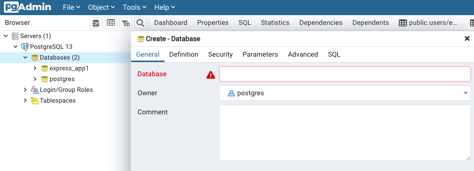
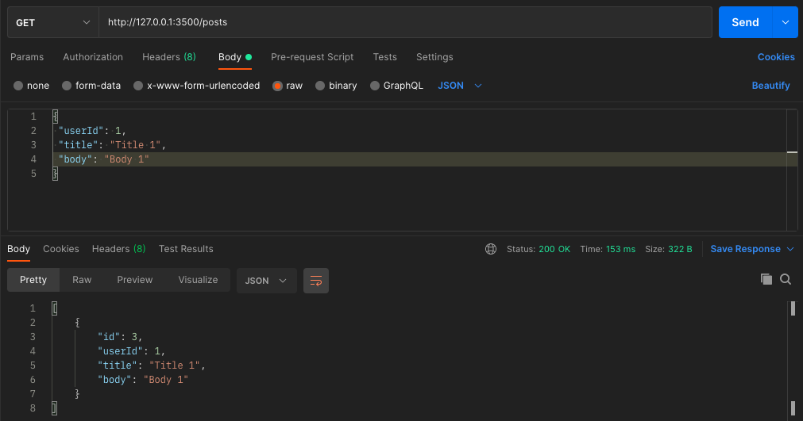

# USING DATABASE POSTGRES
Open your pgAdmin, and create a database:


We are going to create some tables:

This has to be an aspect such as configuration typeorm
```
SERVER_PORT=3543
POSTGRES_HOST=localhost
POSTGRES_PORT=5432 
POSTGRES_USERNAME=postgres 
POSTGRES_PASSWORD=admin
POSTGRES_DATABASE=express_app1
```

This is the configuratin for typeorm: https://typeorm.io/#/using-ormconfig
```
{
   "type": "mysql",
   "host": "localhost",
   "port": 3306,
   "username": "test",
   "password": "test",
   "database": "test"
}
```

Creating entities:
https://typeorm.io/#/entities

to implement entity clases you have to enable Experimental Options from tsconfig.json file:
```
  /* Experimental Options */
    "experimentalDecorators": true,              /* Enables experimental support for ES7 decorators. */
    "emitDecoratorMetadata": true,    
```
```
import {Entity, PrimaryGeneratedColumn, Column} from "typeorm";

@Entity()
export class User {

    @PrimaryGeneratedColumn()
    id: number;

    @Column()
    firstName: string;

    @Column()
    lastName: string;

    @Column()
    isActive: boolean;

}
```
Despues de crear tus talblas , crea la coneccion en server.ts  ctrl-c y npm start 


Making a POST request:


We are going to use the library: dotenv
https://www.npmjs.com/package/dotenv
```npm i dotenv```

Sequelize is a promise-based Node.js ORM for Postgres, MySQL, MariaDB, SQLite and Microsoft SQL Server. It features solid transaction support, relations, eager and lazy loading, read replication and more.
https://sequelize.org/master/index.html

TypeORM is an ORM that can run in NodeJS, Browser, Cordova, PhoneGap, Ionic, React Native, NativeScript, Expo, and Electron platforms and can be used with TypeScript and JavaScript (ES5, ES6, ES7, ES8).
https://typeorm.io/#/

Installing ORM:
https://www.npmjs.com/package/typeorm
```npm i typeorm```

Installing PG(postgres):
https://www.npmjs.com/package/pg
```npm i pg```